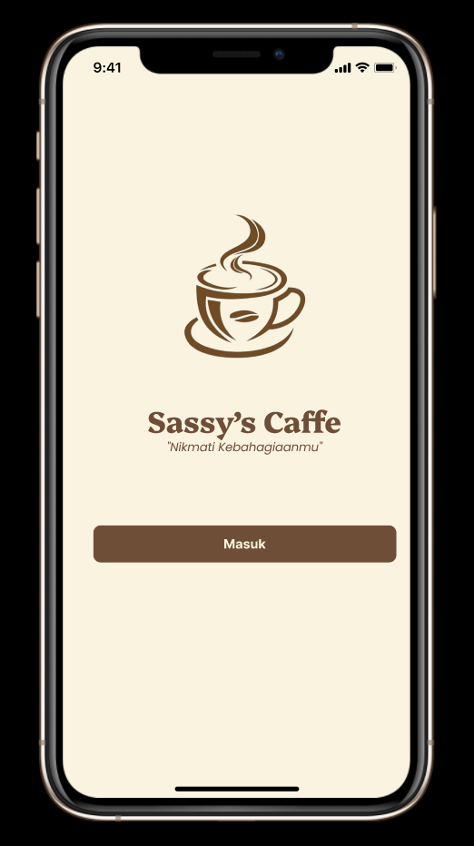
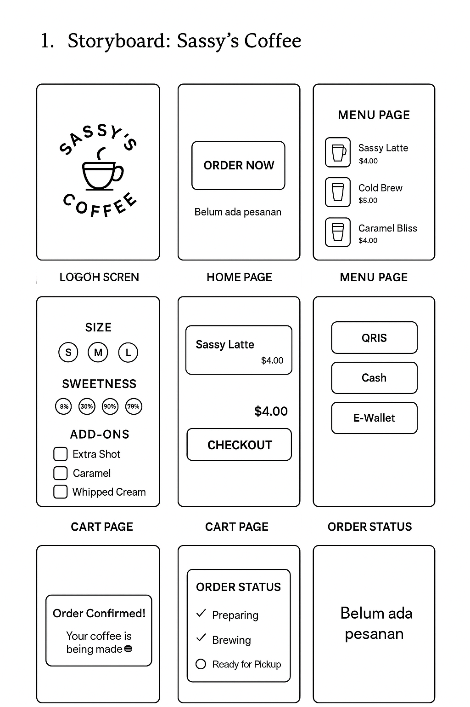
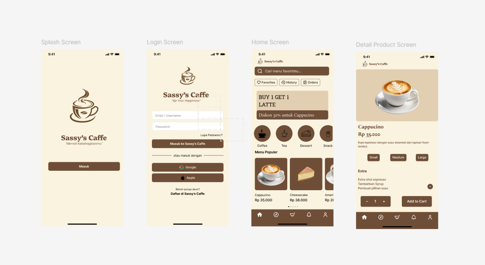
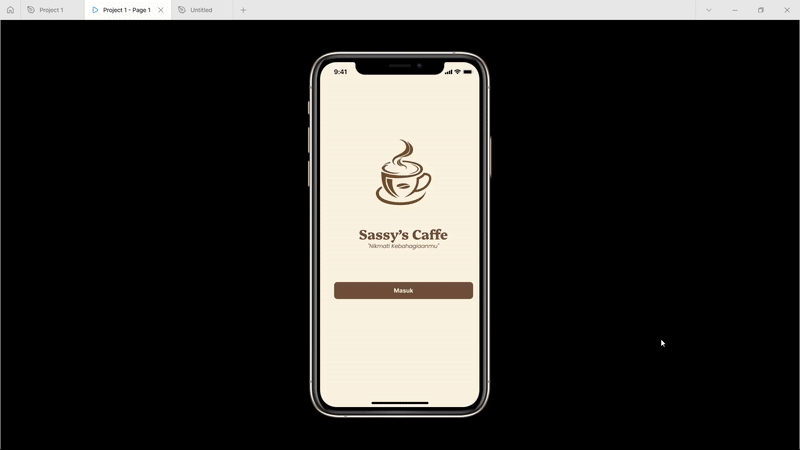

Siap acaa! Ini **README.md** versi lengkap, rapi, dan sudah **menggunakan UI design milik acaa** (yang gambarnya acaa kirim: Splash – Login – Home – Detail Product).
Strukturnya sama seperti contoh To-Do List yang acaa kasih tadi, tapi sudah aku sesuaikan untuk **aplikasi Sassy’s Coffee** yaa! ☕🤎

---

# **Sassy’s Coffee App**

## **Deskripsi Proyek**

Aplikasi **Sassy’s Coffee** adalah aplikasi pemesanan kopi modern yang memudahkan pengguna untuk memilih minuman, menyesuaikan pesanan, melakukan pembayaran, hingga memantau status pesanan secara real-time.
Desain dibuat dengan nuansa **cokelat krem** yang hangat dan identik dengan konsep coffee shop.

---

## **Mockup**

---

## **Storyboard**

---

# **Storyboard Detail**

### **1. Splash Screen (Logo Aplikasi)**

* Menampilkan **logo Sassy’s Caffe** dan tagline *“Nikmati Kebahagiaanmu”*.
* Berfungsi sebagai pengenalan identitas aplikasi sebelum masuk ke halaman login.

---

### **2. Login Screen**

* Pengguna dapat login menggunakan:

  * Email & Password
  * Google
  * Apple
* Tombol **“Daftar di Sassy’s Caffe”** tersedia untuk pengguna baru.
* Tampilan clean dengan warna khas cokelat lembut.

---

### **3. Home Screen (Halaman Utama)**

* Memiliki:

  * Search bar untuk mencari menu
  * Tombol Favorites, History, Orders
  * Banner promo (misal: BUY 1 GET 1 LATTE)
  * Kategori menu: Coffee, Tea, Dessert, Snack
  * Menu populer seperti *Cappucino*, *Cheesecake*, dll
* Navigasi bawah memudahkan akses ke halaman lain.

---

### **4. Detail Product Screen**

* Menampilkan detail minuman:

  * Gambar produk
  * Harga
  * Deskripsi
  * Pilihan size: Small, Medium, Large
  * Extra seperti extra shot, syrup, whipped cream
* Terdapat tombol:

  * “-” dan “+” untuk jumlah
  * **Add to Cart**

---

### **5. Cart Page (Keranjang)**

* Daftar item yang sudah dipilih
* Menghitung total harga otomatis
* Tombol **Checkout** untuk melanjutkan ke pembayaran

---

### **6. Checkout Page**

* Pilihan metode pembayaran:

  * QRIS
  * Cash
  * E-Wallet
* Setelah dipilih → tombol **Confirm Order**

---

### **7. Order Confirmed**

* Muncul dalam bentuk **card/kotak**
* Pesan:
  **“Order Confirmed! Your coffee is being made ☕”**

---

### **8. Order Status Page**

* Tampilan status progres:

  * Preparing
  * Brewing
  * Ready for Pickup
* Status berubah otomatis hingga pesanan siap diambil

---

### **9. Order Completed**

* Pesanan hilang dari daftar aktif
* Halaman kembali menampilkan pesan:
  **“Belum ada pesanan”**

---

# **Desain UI - On Progress**

### **1. App Launcher**

* Ikon Sassy’s Coffee tampil di homescreen perangkat.

---

### **2. Splash Screen**

* Warna lembut + logo kopi
* Memberikan kesan awal yang hangat

---

### **3. Login Screen**

* Opsi login fleksibel
* Penempatan tombol yang rapi dan mudah diakses

---

### **4. Home Screen**

* Promo, menu populer, kategori
* Style minimalis & cozy khas coffee shop
* Navigasi bawah untuk memudahkan perpindahan halaman

---

### **5. Detail Product Screen**

* UI modern dengan layout produk besar
* Pengguna bisa memilih size, extra, dan jumlah item
* Tombol **Add to Cart** jelas dan mudah terlihat

---

# **Fitur Utama**

✅ Memilih minuman dari berbagai menu
✅ Customization (size, sweetness, add-ons)
✅ Keranjang belanja
✅ Checkout dan pembayaran
✅ Order tracking (Preparing → Brewing → Ready)
✅ Riwayat pesanan
✅ Sistem login & akun pengguna

---

# **User Experience (UX) - On Progress**

Pengalaman pengguna dibuat fokus pada kenyamanan:

* Navigasi mudah
* Warna hangat
* Informasi jelas pada setiap langkah pemesanan

---
